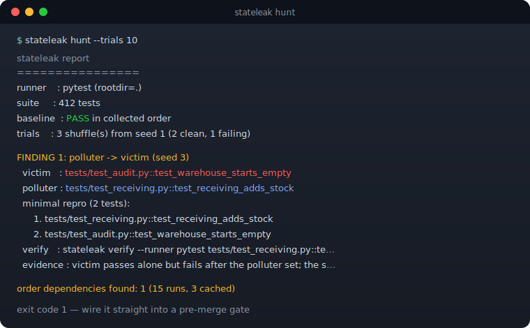
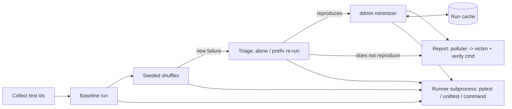

# stateleak

[English](README.md) | [中文](README.zh.md) | [日本語](README.ja.md)

[](LICENSE) [](CHANGELOG.md) [](pyproject.toml)  [](CONTRIBUTING.md)

**オープンソースのテスト順序依存検出ツール——シード付きシャッフルで失敗を暴き、delta debugging が最小の汚染者/被害者テストペアを名指しする。**



```bash
git clone https://github.com/JaydenCJ/stateleak && cd stateleak && pip install -e .
```

> **プレリリース：** stateleak はまだ PyPI に公開されていません。初回リリースまでは [JaydenCJ/stateleak](https://github.com/JaydenCJ/stateleak) をクローンし、リポジトリのルートで `pip install -e .` を実行してください。

## なぜ stateleak か？

順序依存のテストは、並列化するその日まで見えません。`pytest-xdist` を導入した途端、いつも行儀よくアルファベット順に走っていたテストが任意の交錯順で実行され、何年も緑だったスイートが誰にも再現できない形で落ち始めます。`pytest-randomly` のようなシャッフル系プラグインは*ある順序*が失敗することまでは教えてくれますが——その後は 400 テストの順列を渡して健闘を祈るだけです。本当のデバッグ課題は*どの 2 つのテストか*：どれが状態を漏らし（汚染者）、どれがそれに躓くのか（被害者）。stateleak はまさにそれに答えます。再現可能なシードでシャッフルし、失敗プレフィックスを再実行してフレーキーを除外し、先行テスト群を delta debugging で **1-最小の犯人集合**——ほぼ常に単一の汚染者——まで縮小し、テスト 2 つだけの再現コマンドを出力します。プラグインではなく単体のゼロ依存 CLI で、pytest・素の unittest・テストリストを受け取れる任意のコマンドを駆動できます。

|  | stateleak | pytest-randomly | pytest-random-order | iDFlakies |
|---|---|---|---|---|
| 失敗する順序を発見（シード付きシャッフル） | 可 | 可 | 可 | 可 |
| 最小の汚染者/被害者ペアを名指し | 可（ddmin） | 不可 | 不可 | 可 |
| 被害者 / 脆弱テスト / フレーキーを区別 | 可 | 不可 | 不可 | 一部 |
| フレームワーク非依存 | pytest・unittest・任意コマンド | pytest のみ | pytest のみ | JVM/Maven のみ |
| 実行形態 | 単体 CLI、サブプロセス分離 | プロセス内プラグイン | プロセス内プラグイン | Maven プラグイン |
| ランタイム依存 | 0 | pytest プラグイン | pytest プラグイン | JVM ツールチェーン |

<sub>プラグインの挙動は pytest-randomly 4.0 と pytest-random-order 1.2 のドキュメント（2026-07）に基づく：どちらも順序をシャッフルしてシードを報告するが、最小化は行わない。iDFlakies は汚染者検出の学術的リファレンスだが JVM プロジェクト専用。stateleak の依存数は [pyproject.toml](pyproject.toml) の `dependencies = []` の通り。</sub>

## 特徴

- **山ではなく、正確なペアを** — delta debugging（ddmin）が失敗順序を 1-最小の犯人集合へ縮小：どのテストを 1 つ外しても被害者は再び通るため、レポートは「汚染者はこれだ」と正直に言い切れる。
- **整数 2 つで再現可能** — すべての順序は `random.Random(seed)` から導出。CI で見つけたシードはラップトップ上でバイト単位に再現され、各所見にはそのまま貼れる `stateleak verify` コマンドが付く。
- **誠実なトリアージ** — 被害者は単独で再実行、失敗プレフィックスも再実行し、さらに最小再現は断罪前の最後の新規確認実行で失敗しなければならない：結果は 汚染者→被害者、イネーブラ欠落の脆弱テスト、単なるフレーキー に分類され、再現したペアだけが報告される。
- **サブプロセスによるランナー非依存** — pytest（JUnit XML ラウンドトリップ）、素の unittest（同梱の純標準ライブラリ harness、対象環境への追加インストール不要）、任意のコマンドテンプレートを駆動。終了コードしか返さないランナーもプレフィックス二分探索で動く。
- **実行回数に倹約** — プローブは順序単位でメモ化され、単一汚染者の探索はスイート実行 O(log n) 回。レポートは全実行を計上する（`7 runs, 1 cached`）。
- **CI ゲート対応** — 終了コード 0/1/2（クリーン/検出/エラー）、ダッシュボード向け `--json`、軽量なスキャン専用モード `stateleak shuffle`。

## クイックスタート

インストールしたら、同梱のデモスイート（入荷テストがモジュールレベルのキャッシュをリセットし忘れる倉庫アプリ）に向けて実行：

```bash
git clone https://github.com/JaydenCJ/stateleak && cd stateleak && pip install -e .
stateleak hunt --rootdir examples/demo_suite --trials 10
```

実際にキャプチャした出力：

```text
stateleak report
================
runner    : pytest (rootdir=examples/demo_suite)
suite     : 7 tests
baseline  : PASS in collected order
trials    : 1 shuffle(s) from seed 1 (0 clean, 1 failing)

FINDING 1: polluter -> victim (seed 1)
  victim   : test_audit.py::AuditTests::test_warehouse_starts_empty
  polluter : test_receiving.py::ReceivingTests::test_receiving_adds_stock
  minimal repro (2 tests):
      1. test_receiving.py::ReceivingTests::test_receiving_adds_stock
      2. test_audit.py::AuditTests::test_warehouse_starts_empty
  verify   : stateleak verify --runner pytest --rootdir examples/demo_suite test_receiving.py::ReceivingTests::test_receiving_adds_stock test_audit.py::AuditTests::test_warehouse_starts_empty
  evidence : victim passes alone but fails after the polluter set; the set is 1-minimal (removing any test makes the victim pass)

order dependencies found: 1 (7 runs, 1 cached)
```

レポートに出力された `verify` 行を貼れば、テスト 2 つだけでリークを再現できます：

```text
test_receiving.py::ReceivingTests::test_receiving_adds_stock  passed
test_audit.py::AuditTests::test_warehouse_starts_empty        failed
verify: FAIL
```

pytest のないスイートでも使い方は同じ——`--runner unittest` を付けるか、`--runner command --cmd 'make test TESTS="{tests}"'` で任意のランナーを包みます。

## サブコマンド

| コマンド | 役割 |
|---|---|
| `hunt` | ベースライン → シード付きシャッフル → トリアージ → ddmin。`--keep-going` がなければ最初の失敗トライアルで停止 |
| `shuffle` | スキャンのみ：シード付きシャッフルを実行し、どのシードが失敗するかを最小化なしで報告 |
| `bisect` | 既知の失敗順序を最小化。`--order-file`（1 行 1 id）または `--seed` からの再構築で指定 |
| `verify` | 指定した順序で 1 回実行し、テストごとの結果を出力。失敗時は終了コード 1 |
| `plan` | あるシードが生む正確な順序を、何も実行せずに出力 |

## 主要オプション

| キー | デフォルト | 効果 |
|---|---|---|
| `--runner` | `pytest` | スイートの駆動方法：`pytest`・`unittest`・`command`（`--cmd` と併用） |
| `--rootdir` | `.` | スイートを実行するディレクトリ |
| `--trials` | `10` | 試行するシード付きシャッフルの回数 |
| `--seed` | `1` | 基点シード。第 *i* トライアルは `seed+i` を使い、整数 1 つで全てが固定される |
| `--max-victims` | `3` | 最小化する被害者（重複除外）の上限 |
| `--cmd` | — | `--runner command` 用のコマンドテンプレート。`{tests}` は必須、`{junit}` でテスト単位の結果が有効化 |
| `--pytest-args` | — | 毎回の pytest 呼び出しに追加するフラグ（stateleak は順序を掌握するため `addopts` と `pytest-randomly` を無効化する） |
| `--json` | オフ | スクリプト化ゲート向けの機械可読レポート |

終了コード：`0` 順序依存なし、`1` 依存を検出、`2` 用法または基盤エラー。最小化アルゴリズムとその保証・コストモデルは [`docs/algorithm.md`](docs/algorithm.md) に記載。

## 検証

このリポジトリは CI を持ちません。上記の主張はすべてローカル実行で検証しています。チェックアウトから再現するには：

```bash
pip install -e '.[dev]' && pytest && bash scripts/smoke.sh
```

出力（実際の実行からコピー、`...` で省略）：

```text
91 passed in 16.75s
...
[json] polluter/victim pair confirmed
SMOKE OK
```

## アーキテクチャ



## ロードマップ

- [x] シード付きシャッフル試行、4 分類トリアージ、順序保存 ddmin、3 種のランナー、5 つのサブコマンド、JSON レポート（v0.1.0）
- [ ] PyPI 公開（`pip install stateleak`）
- [ ] クリーンアップ提案：状態を*リセット*しているテストを特定し、fixture 化を推奨
- [ ] 並列スケジュールのシミュレーション：一様シャッフルではなく実際の `pytest-xdist` ワーカー交錯を再生
- [ ] 超大規模スイート向けの、呼び出しをまたぐ永続実行キャッシュ

全リストは [open issues](https://github.com/JaydenCJ/stateleak/issues) を参照。

## コントリビュート

コントリビュート歓迎——まずは [good first issue](https://github.com/JaydenCJ/stateleak/issues?q=is%3Aissue+is%3Aopen+label%3A%22good+first+issue%22) から始めるか、[discussion](https://github.com/JaydenCJ/stateleak/discussions) を立ててください。開発環境の構築は [CONTRIBUTING.md](CONTRIBUTING.md) を参照。

## ライセンス

[MIT](LICENSE)
