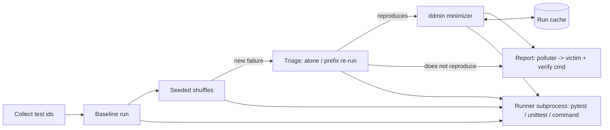

# stateleak

[English](README.md) | [中文](README.zh.md) | [日本語](README.ja.md)

[](LICENSE) [](CHANGELOG.md) [](pyproject.toml)  [](CONTRIBUTING.md)

**Open-source test-order dependency finder — seeded shuffles expose the failure, delta debugging names the minimal polluter/victim pair.**


```bash
git clone https://github.com/JaydenCJ/stateleak && cd stateleak && pip install -e .
```

> **Pre-release:** stateleak is not yet published to PyPI. Until the first release, clone [JaydenCJ/stateleak](https://github.com/JaydenCJ/stateleak) and run `pip install -e .` from the repository root.

## Why stateleak?

Order-dependent tests are invisible right up until the day you parallelize: adopt `pytest-xdist`, and tests that always ran in polite alphabetical order suddenly execute in arbitrary interleavings, and a suite that was green for years fails in ways nobody can reproduce. Randomizing plugins like `pytest-randomly` tell you *that* an order fails — then hand you a 400-test permutation and wish you luck. The actual debugging question is *which two tests*: which one leaks state (the polluter) and which one trips over it (the victim). stateleak answers exactly that. It shuffles with reproducible seeds, re-runs the failing prefix to rule out flakiness, then delta-debugs the predecessors down to a **1-minimal culprit set** — almost always a single polluter — and prints a two-test reproduction command. It is a standalone, zero-dependency CLI, not a plugin: it drives pytest, plain unittest, or any command that can take a test list.

|  | stateleak | pytest-randomly | pytest-random-order | iDFlakies |
|---|---|---|---|---|
| Finds a failing order (seeded shuffle) | Yes | Yes | Yes | Yes |
| Names the minimal polluter/victim pair | Yes (ddmin) | No | No | Yes |
| Distinguishes victim / brittle / flaky | Yes | No | No | Partial |
| Works beyond one framework | pytest, unittest, any command | pytest only | pytest only | JVM/Maven only |
| Runs as | standalone CLI, subprocess-isolated | in-process plugin | in-process plugin | Maven plugin |
| Runtime dependencies | 0 | pytest plugin | pytest plugin | JVM toolchain |

<sub>Plugin behavior as documented for pytest-randomly 4.0 and pytest-random-order 1.2 (2026-07): both reorder and report the seed, neither minimizes. iDFlakies is the academic reference for polluter detection, but targets JVM projects. stateleak's dependency count is `dependencies = []` in [pyproject.toml](pyproject.toml).</sub>

## Features

- **The exact pair, not a haystack** — delta debugging (ddmin) shrinks the failing order to a 1-minimal culprit set: removing any single test makes the victim pass again, so the report can honestly say "this is the polluter".
- **Reproducible by two integers** — every order derives from `random.Random(seed)`; a seed found on CI replays byte-identically on a laptop, and every finding prints a copy-pasteable `stateleak verify` command.
- **Honest triage** — victims are re-run in isolation, failing prefixes are re-run, and the minimal repro must fail one final fresh confirmation run before blame: results are classified as polluter→victim, brittle-test-needs-enabler, or plain flaky — a pair is only reported once it reproduces.
- **Runner-agnostic by subprocess** — drives pytest (JUnit XML round trip), plain unittest (bundled stdlib harness, target env needs nothing installed), or any command template; exit-code-only runners still work via prefix bisection.
- **Run-frugal** — probes are memoized by exact order, single-polluter hunts cost O(log n) suite runs, and the report accounts for every run (`7 runs, 1 cached`).
- **CI-gate ready** — exit code 0/1/2 (clean/found/error), `--json` for dashboards, and `stateleak shuffle` as a cheap scan-only mode.

## Quickstart

Install, then aim it at the shipped demo suite (a warehouse app where a receiving test forgets to reset a module-level cache):

```bash
git clone https://github.com/JaydenCJ/stateleak && cd stateleak && pip install -e .
stateleak hunt --rootdir examples/demo_suite --trials 10
```

Real captured output:

```text
stateleak report
================
runner    : pytest (rootdir=examples/demo_suite)
suite     : 7 tests
baseline  : PASS in collected order
trials    : 1 shuffle(s) from seed 1 (0 clean, 1 failing)

FINDING 1: polluter -> victim (seed 1)
  victim   : test_audit.py::AuditTests::test_warehouse_starts_empty
  polluter : test_receiving.py::ReceivingTests::test_receiving_adds_stock
  minimal repro (2 tests):
      1. test_receiving.py::ReceivingTests::test_receiving_adds_stock
      2. test_audit.py::AuditTests::test_warehouse_starts_empty
  verify   : stateleak verify --runner pytest --rootdir examples/demo_suite test_receiving.py::ReceivingTests::test_receiving_adds_stock test_audit.py::AuditTests::test_warehouse_starts_empty
  evidence : victim passes alone but fails after the polluter set; the set is 1-minimal (removing any test makes the victim pass)

order dependencies found: 1 (7 runs, 1 cached)
```

Paste the printed `verify` line to reproduce the leak with just two tests:

```text
test_receiving.py::ReceivingTests::test_receiving_adds_stock  passed
test_audit.py::AuditTests::test_warehouse_starts_empty        failed
verify: FAIL
```

Suites without pytest work the same way — add `--runner unittest`, or wrap any runner with `--runner command --cmd 'make test TESTS="{tests}"'`.

## Commands

| Command | What it does |
|---|---|
| `hunt` | Baseline → seeded shuffles → triage → ddmin; stops at the first failing trial unless `--keep-going` |
| `shuffle` | Scan-only: run seeded shuffles and report which seeds fail, without minimizing |
| `bisect` | Minimize a known-failing order from `--order-file` (one id per line) or reconstructed via `--seed` |
| `verify` | Run an explicit order once and print per-test outcomes; exit 1 on failure |
| `plan` | Print the exact order a seed produces, without running anything |

## Key options

| Key | Default | Effect |
|---|---|---|
| `--runner` | `pytest` | Suite driver: `pytest`, `unittest`, or `command` (with `--cmd`) |
| `--rootdir` | `.` | Directory the suite runs from |
| `--trials` | `10` | Number of seeded shuffles to try |
| `--seed` | `1` | Base seed; trial *i* uses `seed+i`, so one integer pins everything |
| `--max-victims` | `3` | Cap on how many distinct victims get minimized |
| `--cmd` | — | Command template for `--runner command`; `{tests}` is required, `{junit}` unlocks per-test outcomes |
| `--pytest-args` | — | Extra flags for every pytest invocation (stateleak neutralizes `addopts` and `pytest-randomly` to own the order) |
| `--json` | off | Machine-readable report for scripted gates |

Exit codes: `0` no order dependencies, `1` dependencies found, `2` usage or infrastructure error. The minimization algorithm, its guarantees, and its cost model are documented in [`docs/algorithm.md`](docs/algorithm.md).

## Verification

This repository ships no CI; every claim above is verified by local runs. Reproduce them from a checkout of this repository:

```bash
pip install -e '.[dev]' && pytest && bash scripts/smoke.sh
```

Output (copied from a real run, truncated with `...`):

```text
91 passed in 16.75s
...
[json] polluter/victim pair confirmed
SMOKE OK
```

## Architecture



## Roadmap

- [x] Seeded shuffle trials, four-way triage, order-preserving ddmin, three runners, five subcommands, JSON reports (v0.1.0)
- [ ] PyPI release with `pip install stateleak`
- [ ] Cleaner suggestions: locate the test that *resets* the state and recommend it as a fixture
- [ ] Parallel-schedule simulation: replay real `pytest-xdist` worker interleavings instead of uniform shuffles
- [ ] Persistent run cache across invocations for very large suites

See the [open issues](https://github.com/JaydenCJ/stateleak/issues) for the full list.

## Contributing

Contributions are welcome — start with a [good first issue](https://github.com/JaydenCJ/stateleak/issues?q=is%3Aissue+is%3Aopen+label%3A%22good+first+issue%22) or open a [discussion](https://github.com/JaydenCJ/stateleak/discussions). See [CONTRIBUTING.md](CONTRIBUTING.md) for the development setup.

## License

[MIT](LICENSE)
