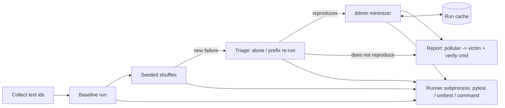

# stateleak

[English](README.md) | [中文](README.zh.md) | [日本語](README.ja.md)

[](LICENSE) [](CHANGELOG.md) [](pyproject.toml)  [](CONTRIBUTING.md)

**开源的测试顺序依赖检测器——种子化乱序暴露失败，delta debugging 直接点名最小的污染者/受害者测试对。**


```bash
git clone https://github.com/JaydenCJ/stateleak && cd stateleak && pip install -e .
```

> **预发布：** stateleak 尚未发布到 PyPI。在首个正式版本之前，请克隆 [JaydenCJ/stateleak](https://github.com/JaydenCJ/stateleak)，并在仓库根目录执行 `pip install -e .`。

## 为什么选 stateleak？

顺序依赖的测试在你并行化那一天之前都是隐形的：一旦引入 `pytest-xdist`，原本总是按字母顺序乖乖执行的测试突然以任意交错运行，绿了多年的套件开始以谁都无法复现的方式失败。`pytest-randomly` 这类乱序插件只告诉你*某个顺序*会失败——然后甩给你一个 400 个测试的排列，祝你好运。真正的调试问题是*究竟是哪两个测试*：哪一个泄漏了状态（污染者），哪一个被绊倒（受害者）。stateleak 回答的正是这个问题。它用可复现的种子乱序，重跑失败前缀以排除偶发抖动，再用 delta debugging 把前驱测试收缩到 **1-最小罪魁集合**——几乎总是单个污染者——并打印一条只含两个测试的复现命令。它是独立的零依赖 CLI 而非插件：可以驱动 pytest、原生 unittest，或任何能接收测试列表的命令。

|  | stateleak | pytest-randomly | pytest-random-order | iDFlakies |
|---|---|---|---|---|
| 找到失败顺序（种子化乱序） | 是 | 是 | 是 | 是 |
| 点名最小污染者/受害者对 | 是（ddmin） | 否 | 否 | 是 |
| 区分受害者 / 脆弱测试 / 偶发失败 | 是 | 否 | 否 | 部分 |
| 跨框架工作 | pytest、unittest、任意命令 | 仅 pytest | 仅 pytest | 仅 JVM/Maven |
| 运行形态 | 独立 CLI，子进程隔离 | 进程内插件 | 进程内插件 | Maven 插件 |
| 运行时依赖 | 0 | pytest 插件 | pytest 插件 | JVM 工具链 |

<sub>插件行为依据 pytest-randomly 4.0 与 pytest-random-order 1.2 的文档（2026-07）：两者都会乱序并报告种子，但都不做最小化。iDFlakies 是污染者检测的学术参考实现，但只面向 JVM 项目。stateleak 的依赖数即 [pyproject.toml](pyproject.toml) 中的 `dependencies = []`。</sub>

## 功能特性

- **给出确切的一对，而非一堆草垛** — delta debugging（ddmin）把失败顺序收缩为 1-最小罪魁集合：从中移除任何一个测试都会让受害者重新通过，因此报告可以坦然地说"污染者就是它"。
- **两个整数即可复现** — 所有顺序都派生自 `random.Random(seed)`；CI 上发现的种子在笔记本上逐字节重放，每条结论都附带可直接粘贴的 `stateleak verify` 命令。
- **诚实的分诊** — 受害者会被单独重跑、失败前缀会被重跑，最小复现还必须在定罪前的最后一次全新确认运行中失败：结果被归类为 污染者→受害者、脆弱测试缺少使能者、或纯粹偶发——只有能复现的一对才会被报告。
- **靠子进程实现运行器无关** — 可驱动 pytest（JUnit XML 往返）、原生 unittest（内置纯标准库 harness，目标环境无需安装任何东西），或任意命令模板；只报退出码的运行器也能靠前缀二分工作。
- **省着跑** — 探测按精确顺序记忆化，单污染者狩猎只需 O(log n) 次套件运行，报告对每次运行都有账目（`7 runs, 1 cached`）。
- **CI 门禁就绪** — 退出码 0/1/2（干净/发现/错误），`--json` 供仪表盘使用，`stateleak shuffle` 则是廉价的仅扫描模式。

## 快速上手

安装后，对准随附的演示套件（一个仓库管理应用，其中的收货测试忘了重置模块级缓存）：

```bash
git clone https://github.com/JaydenCJ/stateleak && cd stateleak && pip install -e .
stateleak hunt --rootdir examples/demo_suite --trials 10
```

真实捕获的输出：

```text
stateleak report
================
runner    : pytest (rootdir=examples/demo_suite)
suite     : 7 tests
baseline  : PASS in collected order
trials    : 1 shuffle(s) from seed 1 (0 clean, 1 failing)

FINDING 1: polluter -> victim (seed 1)
  victim   : test_audit.py::AuditTests::test_warehouse_starts_empty
  polluter : test_receiving.py::ReceivingTests::test_receiving_adds_stock
  minimal repro (2 tests):
      1. test_receiving.py::ReceivingTests::test_receiving_adds_stock
      2. test_audit.py::AuditTests::test_warehouse_starts_empty
  verify   : stateleak verify --runner pytest --rootdir examples/demo_suite test_receiving.py::ReceivingTests::test_receiving_adds_stock test_audit.py::AuditTests::test_warehouse_starts_empty
  evidence : victim passes alone but fails after the polluter set; the set is 1-minimal (removing any test makes the victim pass)

order dependencies found: 1 (7 runs, 1 cached)
```

粘贴报告里打印的 `verify` 命令，只用两个测试即可复现这次泄漏：

```text
test_receiving.py::ReceivingTests::test_receiving_adds_stock  passed
test_audit.py::AuditTests::test_warehouse_starts_empty        failed
verify: FAIL
```

没有 pytest 的套件用法完全一致——加上 `--runner unittest`，或用 `--runner command --cmd 'make test TESTS="{tests}"'` 包住任意运行器。

## 子命令

| 命令 | 作用 |
|---|---|
| `hunt` | 基线 → 种子化乱序 → 分诊 → ddmin；默认在第一个失败轮次停下，除非加 `--keep-going` |
| `shuffle` | 仅扫描：运行种子化乱序并报告哪些种子失败，不做最小化 |
| `bisect` | 最小化一个已知失败的顺序，来自 `--order-file`（每行一个 id）或用 `--seed` 重建 |
| `verify` | 按给定顺序运行一次并打印逐测试结果；失败时退出码为 1 |
| `plan` | 打印某个种子产生的精确顺序，不运行任何东西 |

## 关键选项

| 键 | 默认值 | 效果 |
|---|---|---|
| `--runner` | `pytest` | 套件驱动方式：`pytest`、`unittest` 或 `command`（配合 `--cmd`） |
| `--rootdir` | `.` | 套件运行所在目录 |
| `--trials` | `10` | 尝试的种子化乱序轮数 |
| `--seed` | `1` | 基础种子；第 *i* 轮使用 `seed+i`，一个整数钉死一切 |
| `--max-victims` | `3` | 最多对多少个不同受害者做最小化 |
| `--cmd` | — | `--runner command` 的命令模板；`{tests}` 必需，`{junit}` 可解锁逐测试结果 |
| `--pytest-args` | — | 附加到每次 pytest 调用的额外参数（stateleak 会屏蔽 `addopts` 与 `pytest-randomly` 以掌控顺序） |
| `--json` | 关 | 供脚本化门禁使用的机器可读报告 |

退出码：`0` 无顺序依赖，`1` 发现依赖，`2` 用法或基础设施错误。最小化算法、其保证与成本模型记录在 [`docs/algorithm.md`](docs/algorithm.md)。

## 验证

本仓库不带 CI；上述每一条主张都由本地运行验证。从本仓库的检出即可复现：

```bash
pip install -e '.[dev]' && pytest && bash scripts/smoke.sh
```

输出（拷贝自真实运行，用 `...` 截断）：

```text
91 passed in 16.75s
...
[json] polluter/victim pair confirmed
SMOKE OK
```

## 架构



## 路线图

- [x] 种子化乱序轮次、四路分诊、保序 ddmin、三种运行器、五个子命令、JSON 报告（v0.1.0）
- [ ] 发布到 PyPI，支持 `pip install stateleak`
- [ ] 清理建议：定位真正*重置*状态的测试，并推荐将其改写为 fixture
- [ ] 并行调度模拟：重放真实的 `pytest-xdist` worker 交错，而非均匀乱序
- [ ] 跨调用持久化运行缓存，服务超大型套件

完整列表见 [open issues](https://github.com/JaydenCJ/stateleak/issues)。

## 参与贡献

欢迎贡献——可以从 [good first issue](https://github.com/JaydenCJ/stateleak/issues?q=is%3Aissue+is%3Aopen+label%3A%22good+first+issue%22) 入手，或发起一个 [discussion](https://github.com/JaydenCJ/stateleak/discussions)。开发环境搭建见 [CONTRIBUTING.md](CONTRIBUTING.md)。

## 许可证

[MIT](LICENSE)
